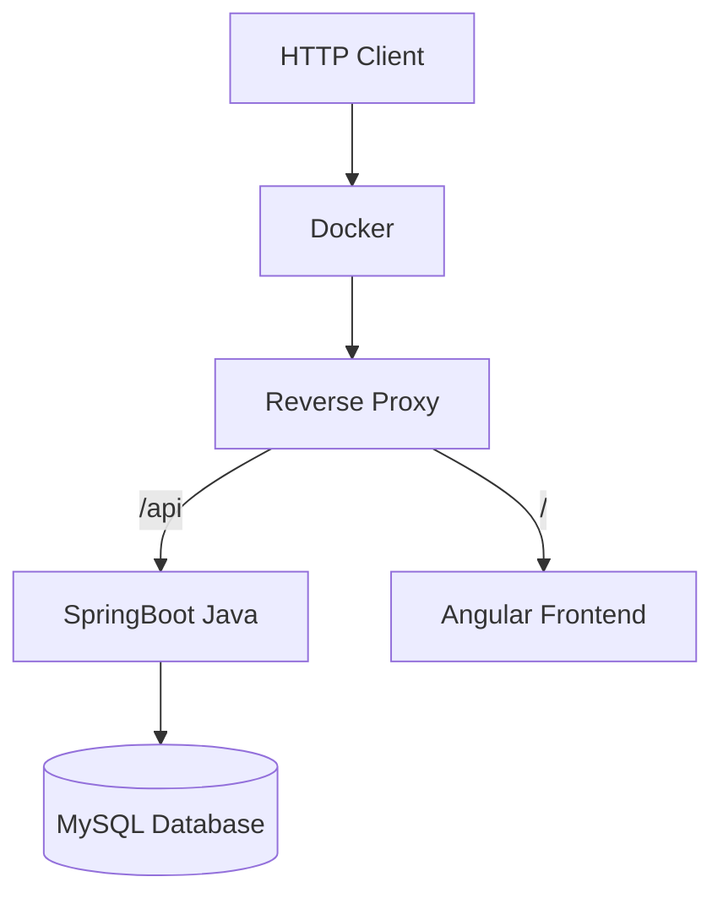

# Welcome to The Real World Programmer - Fullstack Tutorial

Follow each guide in order:
* 1-DOCKER.md
* 2-LIQUIBASE.md
* 3-BACKEND.md
* 4-FRONTEND.md

### Our full stack implementation includes

* A docker server running an Apache reverse proxy and a MySQL database
* A SpringBoot Java application for backend
* An Angular frontend application
* This is a very generic, yet flexible tech stack that may be used to build many types of applications

