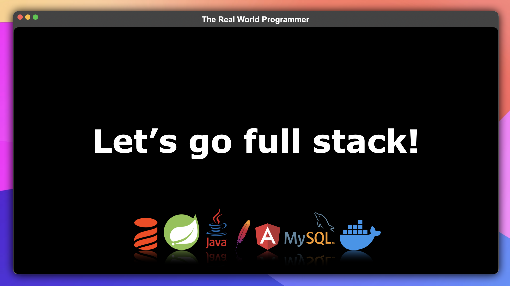

# Welcome to The Real World Programmer - Fullstack Tutorial

This tutorial will help you get started with a fullstack development
environment. 

This tech stack includes:
* Docker
* MySQL
* Apache
* Java
* Spring Boot
* Angular 
* Liquibase

We will build a simple dictionary application in which 
words along with their definitions are stored in a `definitions` table.

The `definitions` will be loaded from the [MySQL](https://www.mysql.com/) database, exposed through a 
[RESTful](https://en.wikipedia.org/wiki/REST) [API](https://en.wikipedia.org/wiki/API) on the 
[Spring Boot](https://spring.io/projects/spring-boot/) [Java](https://www.java.com/en/) backend and rendered on 
[Angular](https://angular.io/) frontend with [Angular Material](https://material.angular.io/) [CSS](https://en.wikipedia.org/wiki/CSS):

Follow each guide in order:
* [1-DOCKER.md](1-DOCKER.md)
* [2-LIQUIBASE.md](2-LIQUIBASE.md)
* [3-BACKEND.md](3-BACKEND.md)
* [4-FRONTEND.md](4-FRONTEND.md)

## Our full stack implementation includes

* A [Docker](https://www.docker.com/) server running an [Apache](https://httpd.apache.org/) [reverse proxy](https://en.wikipedia.org/wiki/Reverse_proxy) and a MySQL database
* A SpringBoot Java application for backend
* An Angular frontend application
* This is a very generic, yet flexible tech stack that may be used to build many types of applications
* You may choose to replace any of the building blocks with other technologies, it is entirely up to you 
* and I have created a stack based on what I have the most experience with:
  * HTTP Clients: Web browser, cURL, Postman...
  * Proxy: Apache, [nginx](https://www.nginx.com/), [traefik](https://traefik.io/traefik/)...
  * Backend: Spring Boot Java, go, python, node.js...
  * Frontend: Angular, Vue.js, React.js...

High level architecture diagram:

